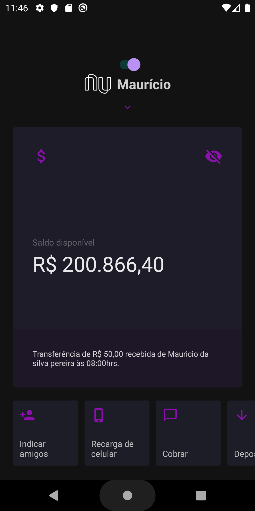
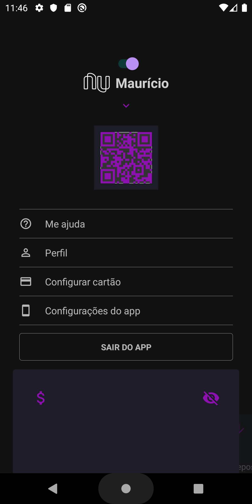

# Nubank Dark Mode :iphone:

## About

Project that adds functionality in an obscure way in the Nubank app, my goal is to practice my knowledge with this project.

## Technology
- **React Native** - A lib that provides a way to create native apps for Android and iOS.
<a href="https://facebook.github.io/react-native/"><strong>about</strong></a>

- **Styled components** - Visual primitives for the component age.
<a href="https://styled-components.com/"><strong>about</strong></a>
- **Template rocketseat** - Template created by the rocketseat team to streamline the process of installing necessary packages, so as not to hinder the development flow. <a href="https://github.com/Rocketseat/react-native-template-rocketseat-basic"><strong>about</strong></a>
## Getting started
- Clone this repo using `git@github.com:MauricioSilv/nubank-app-dark.git`
- Enter directory: `cd nubank-app-dark` 
- Run `yarn` to install dependencies 

## Run app
- Run `react-native run-android` if you use it on the android simulator;
- If you use simulator IOS, run `react-native run-ios`;

:warning:  First of all, start the simulator in the case of android.

